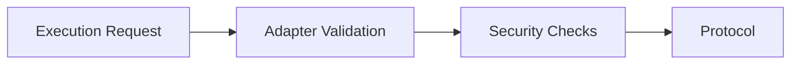

# Adapter System

Adapters are the foundation of Yield Seeker's execution framework.

Rather than allowing agents to interact directly with arbitrary smart contracts, every protocol interaction is routed through a dedicated adapter responsible for validating the transaction before execution.

This architecture allows the protocol to automate complex DeFi operations while maintaining strong execution guarantees.

---

## Why Adapters Exist

Every DeFi protocol has different interfaces, assumptions, and security considerations.

Instead of embedding protocol-specific logic inside the wallet itself, Yield Seeker separates these responsibilities into individual adapters.

Each adapter understands:

- how deposits work
- how withdrawals work
- how rewards are claimed
- how protocol-specific validation should be performed

This modular design makes the system easier to audit, extend, and secure.

---

## Validation Before Execution

Before any transaction is executed, the adapter performs protocol-specific validation.

Depending on the protocol, this may include verifying:

- destination addresses
- vault registration
- underlying assets
- reward recipients
- protocol configuration

Only after these checks succeed is the transaction allowed to proceed.

---

## Registered Adapters

Only adapters that have been registered by the protocol can be used.

Similarly, each adapter may only communicate with protocol targets that have also been explicitly registered.

This creates two independent layers of protection:

1. The adapter itself must be trusted.
2. The destination protocol must also be trusted.

Removing either registration immediately prevents further interaction.

---

## Emergency Controls

In the event of an operational incident, Yield Seeker can immediately pause adapter execution across the protocol.

This emergency control prevents agents from executing further protocol interactions while preserving user ownership of funds.

Importantly, pausing the adapter system does **not** prevent users from withdrawing assets from their wallets.

---

## User-Level Controls

Users are not limited to protocol-wide protections.

Each Agent Wallet also allows users to define additional restrictions by blocking:

- specific adapters
- specific protocol targets

These controls are scoped to an individual wallet and provide an additional layer of personal risk management.

---

## Extensible by Design

Adapters are intentionally modular.

Supporting a new protocol does not require redesigning the wallet architecture. Instead, new capabilities are introduced by deploying new adapters and registering approved targets.

All administrative changes are protected by:

- audited smart contracts
- hardware-backed multisignature approval
- a four-day timelock

This allows Yield Seeker to evolve while preserving a predictable and transparent execution model.