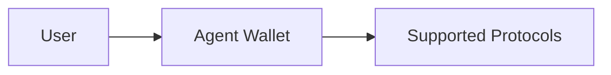

# Agent Wallet

Every Yield Seeker agent is built around a dedicated **Agent Wallet**. This smart wallet is where your assets are held, where protocol interactions occur, and where all yield is accrued.

Unlike traditional DeFi applications that require users to interact directly with multiple protocols, the Agent Wallet acts as a secure execution environment between your assets and the wider DeFi ecosystem.

Each wallet is deployed exclusively for a single user and operates independently from every other wallet in the protocol.

---

## Isolated by Design

Every Agent Wallet is completely isolated.

There is no pooled custody layer and no shared wallet between users. Assets belonging to one agent cannot interact with assets belonging to another.

This isolation significantly reduces the impact of potential failures by ensuring every user's portfolio remains independent.

---

## Ownership

Although Yield Seeker manages portfolio allocation automatically, ownership of the wallet remains with the user.

Only the wallet owner may:

- withdraw funds
- upgrade their wallet implementation
- block adapters
- block protocol targets

No server, operator, or administrator can initiate withdrawals from a user's wallet.

---

## Smart Account Infrastructure

Agent Wallets are built using modern account abstraction standards.

This architecture enables:

- sponsored transactions
- batched execution
- delegated agent operations
- flexible protocol integrations

while maintaining strict permission controls over what agents are allowed to execute.

---

## Designed for Long-Term Evolution

The wallet architecture is intentionally modular.

Rather than replacing wallets whenever new functionality becomes available, new capabilities can be introduced through carefully controlled protocol extensions.

These changes are protected by:

- audited smart contracts
- hardware-backed multisignature approval
- a four-day administrative timelock

giving users time to review changes and withdraw funds if they choose.

---

## User Rights

Regardless of future protocol upgrades, users retain the same fundamental rights:

- Withdraw assets at any time
- Disable individual protocol targets
- Block specific adapters
- Upgrade only to approved wallet implementations
- Exit the protocol entirely whenever they choose

These guarantees ensure that automation never comes at the expense of user control.