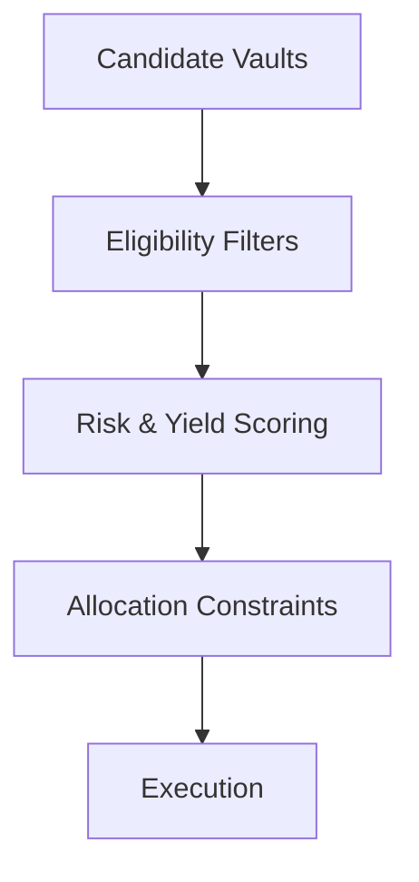

# Decision Pipeline

Every time a Yield Seeker agent considers reallocating capital, it follows the same structured decision process.

Rather than selecting the highest advertised APY, candidate opportunities pass through multiple stages of evaluation before execution is considered.

Each stage reduces the candidate set until only suitable allocations remain.

---

## Stage 1 — Candidate Discovery

The allocation engine begins by identifying supported vaults across the Base ecosystem.

Only protocols that have been registered within Yield Seeker's execution framework are considered.

Protocols outside the allowlist are ignored entirely.

---

## Stage 2 — Eligibility Filters

Each candidate vault is evaluated against a series of binary checks.

Examples include:

- minimum TVL
- supported vault type
- collateral exclusions
- protocol availability
- liquidity requirements
- user-defined restrictions

If any mandatory condition fails, the vault is removed from consideration before scoring begins.

---

## Stage 3 — Risk & Yield Scoring

Eligible vaults are then ranked.

Rather than optimising purely for APY, the scoring engine considers multiple dimensions simultaneously, including:

- expected yield
- protocol incentives
- historical stability
- liquidity depth
- transaction costs

This allows the allocation engine to optimise for long-term returns rather than reacting to short-term yield spikes.

---

## Stage 4 — Allocation Constraints

Before execution, additional portfolio-level constraints are applied.

These include:

- concentration limits
- maximum exposure per vault
- user allocation rules
- forced allocations
- protocol-specific limits

Even the highest-scoring vault may receive only part of a portfolio if diversification constraints require it.

---

## Stage 5 — Execution

Only after every previous stage has completed successfully does the execution engine begin interacting with supported protocols.

Execution itself is performed through the protocol's constrained adapter framework, ensuring every transaction satisfies protocol-defined security checks.

---

## Explainable Decisions

Every allocation follows the same deterministic pipeline.

Users can inspect these decisions through the **Discuss** tab by asking their agent why a portfolio change occurred or why a particular vault was selected.

This makes portfolio management transparent rather than opaque.