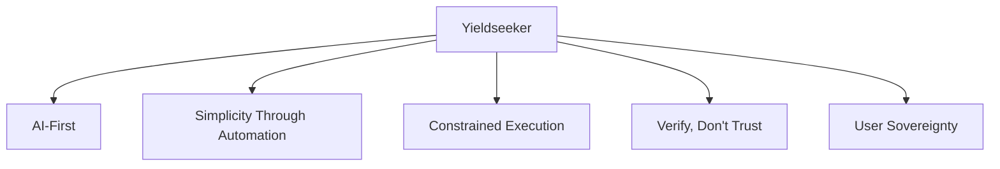
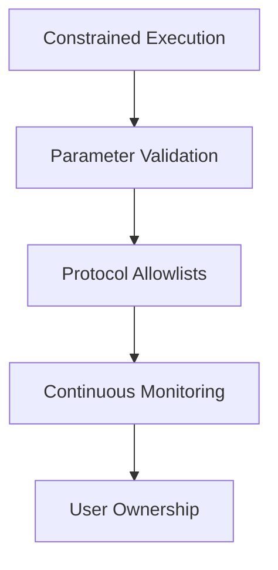

# Design Principles

Yieldseeker is built around a small number of fundamental principles that guide every architectural decision across the protocol.

These principles influence everything from how agents allocate capital to how smart contracts are designed, how security controls are implemented, and how users interact with the platform.

The philosophy is simple: use intelligent automation to make sophisticated DeFi accessible while maintaining strong security guarantees and keeping users in control of their assets.

---

## Core Principles

The following principles define the philosophy behind Yieldseeker and influence every aspect of the protocol's design.

---

### AI-First

Yieldseeker is built around the idea that autonomous AI agents should act as intelligent portfolio managers rather than simple automation tools.

Instead of requiring users to manually compare vaults, monitor changing yields, claim rewards, or rebalance positions, each agent continuously evaluates supported opportunities and makes informed allocation decisions on the user's behalf.

The goal is not simply to automate transactions—it is to provide an intelligent assistant capable of making sophisticated portfolio management accessible to everyone.

---

### Simplicity Through Automation

DeFi has become increasingly powerful, but also increasingly complex.

Managing a portfolio often requires monitoring multiple protocols, comparing yields, tracking reward incentives, claiming rewards, and regularly rebalancing positions as market conditions change.

Yieldseeker removes this operational burden.

Users simply create an agent, deposit their assets, and optionally define preferences for how the agent should behave. From that point onwards, portfolio management is handled automatically while remaining transparent, explainable, and fully under the user's control.

Sophisticated portfolio management should feel effortless without sacrificing transparency or flexibility.

---

### Constrained Execution

Automation should never require unrestricted authority.

Rather than allowing agents to perform arbitrary blockchain transactions, Yieldseeker limits every action through protocol-defined execution rules.

Every transaction must pass through registered adapters, interact only with approved protocol targets, and satisfy protocol-specific parameter validation before execution is permitted.

This means the allocation engine decides **what** should happen, while the protocol itself determines **what is actually allowed** to happen.

By constraining execution instead of trusting operators, the protocol significantly reduces the potential impact of software bugs, operational mistakes, or compromised infrastructure.

---

### Verify, Don't Trust

Good portfolio decisions require reliable information.

Wherever possible, Yieldseeker derives information directly from on-chain state rather than relying on third-party dashboards or protocol-reported statistics.

The allocation engine independently evaluates factors such as:

- total value locked
- available liquidity
- lending rates
- collateral composition
- vault accounting
- reward emissions

Reading protocol state directly from smart contracts reduces dependence on external services and provides a more accurate view of current market conditions.

This philosophy extends beyond data collection. Smart contracts, execution permissions, protocol integrations, and administrative changes are all designed to be transparent and independently verifiable on-chain.

Trust should never be required where verification is possible.

---

### User Sovereignty

Automation should simplify portfolio management—not reduce user control.

Every user receives an isolated Agent Wallet that remains under their ownership throughout its lifetime.

Users retain the ability to:

- withdraw funds at any time
- leave the protocol whenever they choose
- customise how their agent behaves
- block individual protocol targets
- block individual adapters

Administrative changes are similarly designed to respect user choice.

New protocol capabilities cannot become active immediately. Instead, administrative extensions are protected by hardware-backed multisignature approval and a four-day timelock, providing users with advance notice before new functionality becomes available.

Yieldseeker manages portfolios autonomously, but users remain the final authority over their assets.

---

## Applying the Principles

The core principles above influence not only how Yieldseeker behaves today, but also how the protocol evolves over time.

### Continuous Improvement

Decentralized finance evolves rapidly.

New protocols emerge, existing protocols improve, and market conditions change continuously.

Yieldseeker is designed to evolve alongside the ecosystem without compromising its security model.

Rather than rebuilding the protocol whenever new opportunities appear, its modular architecture allows new assets, adapters, vaults, and autonomous capabilities to be introduced through transparent administrative extensions.

Every extension follows the same review, approval, and timelock process before becoming available to users.

This approach allows the protocol to expand while maintaining a predictable and well-understood execution model.

---

### Security Through Layers

No single security mechanism is relied upon to protect user assets.

Instead, Yieldseeker combines multiple independent layers of protection that reinforce one another.

If one layer were ever to fail, additional safeguards continue limiting what can occur.

This layered approach is more resilient than relying on any single security assumption.

---

## Building for the Long Term

Yieldseeker is designed to evolve without compromising the principles on which it was built.

As new assets, protocols, and autonomous capabilities are introduced, every addition is evaluated against the protocol's core principles before becoming available to users.

Those principles remain constant:

- **AI-First** ensures users benefit from intelligent portfolio management rather than manual optimisation.
- **Simplicity Through Automation** removes operational complexity without sacrificing transparency.
- **Constrained Execution** ensures agents only perform authorised actions.
- **Verify, Don't Trust** ensures decisions are based on independently verifiable information.
- **User Sovereignty** ensures users remain in control of their assets.

These principles are intended to guide Yieldseeker not only today, but as the protocol continues to evolve over the years ahead.