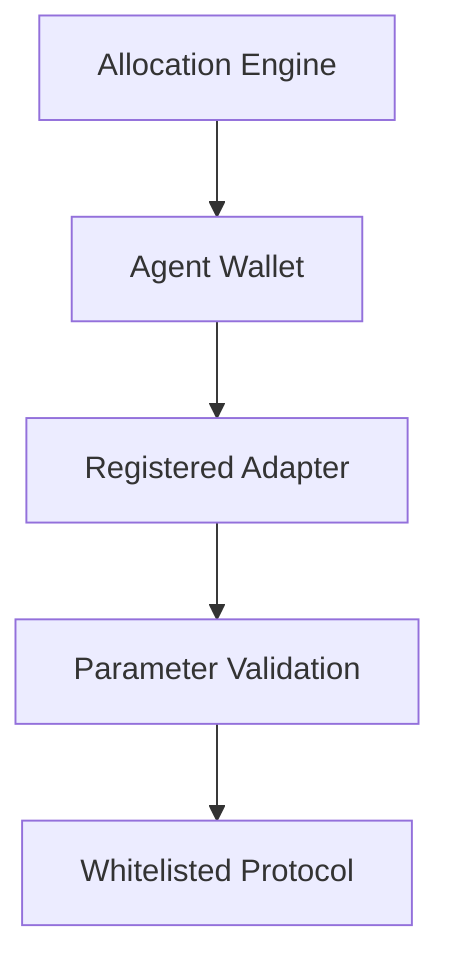

# Execution Model

Yield Seeker agents do not have unrestricted control over user wallets.

Instead, every transaction passes through a constrained execution framework designed to ensure that agents can only perform explicitly authorised actions.

This approach dramatically reduces the attack surface compared to traditional delegated wallets.

---

## Execution Flow

Whenever an agent decides to rebalance a portfolio, execution follows the same sequence.

At no point can the agent directly call arbitrary smart contracts.

---

## Adapter-Based Execution

Every supported protocol has a dedicated adapter.

Adapters understand how a specific protocol operates and validate every interaction before execution.

Examples include:

- Aave
- Morpho
- Compound
- ERC-4626 vaults
- Reward claiming
- Token swaps

Rather than allowing arbitrary contract calls, the wallet only permits execution through registered adapters.

---

## Parameter Validation

Traditional permission systems typically restrict **which function** may be called.

Yield Seeker goes further by validating **how that function is called**.

Before execution, adapters verify parameters such as:

- destination addresses
- protocol targets
- supported assets
- expected recipients

For example, reward claims and token swaps are only valid if the resulting assets are returned to the user's own wallet.

This prevents an authorised transaction from redirecting assets elsewhere.

---

## Registered Targets

Even a valid adapter cannot interact with arbitrary contracts.

Every protocol endpoint must first be registered within the protocol's on-chain registry before it becomes reachable.

This means agents are limited to interacting only with explicitly approved vaults, pools, and protocol contracts.

---

## No Arbitrary Execution

One of the most important security properties of the protocol is what **cannot** happen.

The Agent Wallet intentionally disables arbitrary contract execution.

Instead of allowing unrestricted blockchain interactions, every operation must pass through the adapter framework.

This means that even if an operator were compromised, they would still be unable to execute arbitrary transactions or redirect assets outside the wallet.

---

## Extending the Protocol

As Yield Seeker expands, additional protocols and strategies can be introduced without changing the wallet architecture.

New capabilities are added by registering new adapters and approved targets through the protocol's administrative process.

Every extension is protected by:

- hardware-backed multisignature approval
- smart contract validation
- a four-day timelock
- public on-chain execution

allowing users to observe upcoming changes before they become active.