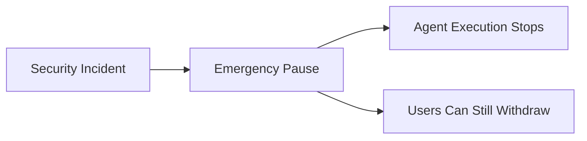

# Exit & Recovery

One of Yield Seeker's core design principles is **User Sovereignty**.

Users should never depend entirely on the continued operation of the Yield Seeker application to retain access to their assets.

For this reason, the protocol has been designed with multiple recovery paths that allow users to regain control under a variety of scenarios.

---

## Standard Withdrawals

Users may withdraw their assets at any time through the Yield Seeker interface.

Only the owner of an Agent Wallet can initiate withdrawals.

Neither the Yield Seeker backend nor protocol administrators can withdraw assets from a user's wallet.

---

## Frontend or Backend Unavailability

If the Yield Seeker application is temporarily unavailable, users do not lose ownership of their Agent Wallet.

Our support team can assist users in interacting directly with the underlying smart contracts to recover their assets.

The application provides convenience—not custody.

---

## Protocol Incidents

If a supported protocol experiences elevated risk, unexpected behaviour, or a publicly disclosed exploit, Yield Seeker may attempt to reduce or remove exposure by reallocating capital to safer supported alternatives.

Because DeFi protocols remain permissionless systems, no protocol can guarantee that withdrawals will always succeed under extreme market conditions.

For example, a sudden liquidity run or protocol-wide failure may temporarily limit the ability to exit a position immediately.

Yield Seeker is designed to respond as quickly as possible while remaining transparent about these inherent limitations.

---

## Emergency Pause

Yield Seeker includes an emergency pause mechanism that immediately prevents further agent execution across the protocol.

This control is intended for situations such as:

- suspected infrastructure compromise
- operational incidents
- unexpected protocol behaviour
- security investigations

Importantly, pausing execution **does not prevent users from withdrawing funds** from their own Agent Wallets.

Only automated execution is suspended.

---

## Administrative Changes

Yield Seeker continues to evolve by supporting additional assets, protocols, and autonomous capabilities.

To protect users, administrative extensions cannot become active immediately.

Every protocol extension is protected by:

- hardware-backed multisignature approval
- a four-day administrative timelock

This provides users with advance notice of upcoming protocol changes and an opportunity to withdraw their assets before new functionality becomes available if they choose.

---

## User Exit Rights

Regardless of future protocol upgrades or operational changes, users always retain the ability to:

- withdraw their assets
- deactivate their participation
- block specific protocol targets
- block individual adapters
- choose whether to remain in the protocol

These guarantees ensure that users remain in control throughout the lifetime of their Agent Wallet.