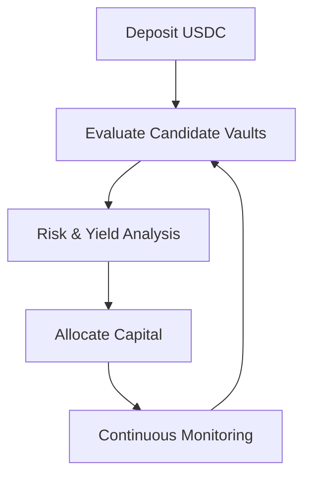

# How It Works

Yield Seeker is designed to make sophisticated DeFi portfolio management accessible through a simple workflow. After an agent has been created and funded, it operates autonomously while remaining constrained by the protocol's security model.

---

## Step 1 — Connect Your Wallet

Begin by connecting a supported wallet on the Base network.

Your connected wallet becomes the owner of a dedicated **Agent Wallet**, which will hold and manage your deposited assets.

---

## Step 2 — Create Your Agent

Creating an agent deploys an isolated smart wallet associated exclusively with your account.

Each agent is independent. Users can operate multiple agents simultaneously, each with different assets, strategies, or custom rules.

---

## Step 3 — Deposit Funds

Deposit USDC into your agent wallet.

Once funded, the agent becomes eligible to begin allocating capital across supported protocols.

---

## Step 4 — Let the Agent Work

From this point onwards, the allocation engine continuously evaluates supported vaults across the Base ecosystem.

Rather than remaining invested in a single protocol indefinitely, the agent continually compares opportunities and reallocates capital whenever doing so improves expected net returns after accounting for transaction costs and risk constraints.

---

## Autoseek Strategy

Every Yield Seeker agent runs **Autoseek**, the platform's default allocation strategy.

Autoseek continuously:

- evaluates supported vaults
- reallocates capital when appropriate
- compounds earned rewards
- converts reward tokens back into the base asset
- minimises unnecessary transaction costs

Rather than chasing the highest advertised APY, Autoseek seeks the highest **risk-adjusted** return over time.

---

## Explainable Decisions

Every portfolio decision made by an agent can be inspected through the **Discuss** tab.

Users can ask questions such as:

- Why was my portfolio rebalanced?
- Why did you choose this vault?
- Why didn't you move into another opportunity?
- What risks are you currently considering?

The agent explains its reasoning in natural language, providing transparency into its decision-making process without requiring users to understand the underlying implementation.

---

## Human Control

Although portfolio management is automated, users remain in control.

You may:

- withdraw funds at any time
- customise your agent's behaviour
- specify vault preferences
- create allocation rules
- deactivate an agent whenever you choose

Automation is designed to reduce operational complexity—not to remove user control.