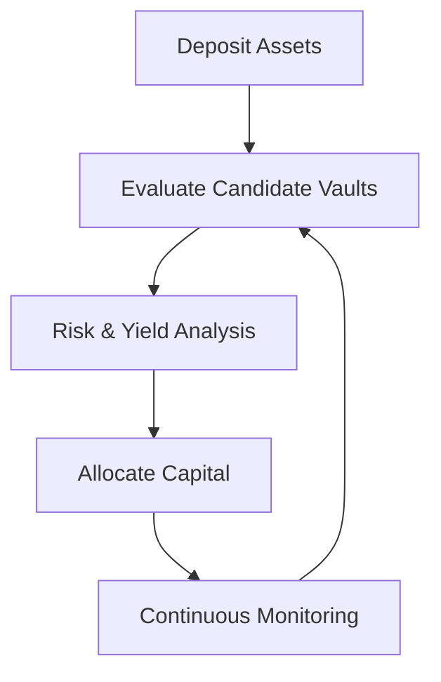

# How It Works

Yieldseeker is designed to make sophisticated DeFi portfolio management feel effortless.

After creating an agent, selecting an investment style, and depositing supported assets, your agent begins managing your portfolio autonomously. If you want greater control, you can also customise its behaviour simply by talking to it.

---

## Step 1 — Connect Your Wallet

Begin by connecting a supported wallet on the Base network.

Your connected wallet becomes the owner of a dedicated **Agent Wallet**, which securely holds and manages your deposited assets.

---

## Step 2 — Create Your Agent

Creating an agent deploys an isolated smart wallet associated exclusively with your account.

Each agent is completely independent. You can create multiple agents, each with different assets, investment styles, or personalised preferences.

---

## Step 3 — Choose an Investment Style

Every new agent begins with a default investment style that determines how it approaches portfolio management.

- **Conservative** focuses on established vaults with proven track records.
- **Explorative** targets higher yields across a broader range of supported opportunities.

These presets provide sensible defaults while remaining fully customisable over time.

---

## Step 4 — Deposit Supported Assets

Deposit supported assets into your Agent Wallet.

Once funded, your agent becomes eligible to begin allocating capital across supported DeFi protocols.

---

## Step 5 — Autoseek Goes to Work

Every Yieldseeker agent runs **Autoseek**, the protocol's autonomous portfolio management engine.

Autoseek continuously:

- evaluates supported vaults
- analyses yield opportunities and portfolio risk
- reallocates capital when appropriate
- compounds earned rewards
- minimises unnecessary transaction costs

Rather than chasing the highest advertised APY, Autoseek seeks the highest long-term **risk-adjusted** return while respecting your selected investment style and any preferences you have configured.

---

## Personalise Your Agent

Your agent works immediately using its default investment style, but you can refine its behaviour at any time.

Through the **Discuss** tab, you can speak naturally with your agent and describe how you would like it to manage your portfolio.

For example:

- "Only use Morpho vaults."
- "Prefer stable yields over maximum returns."
- "Only consider vaults with at least \$10 million in TVL."
- "Always ensure there's sufficient liquidity for withdrawals."

Yieldseeker remembers these preferences and converts them into structured rules that directly influence how Autoseek manages your portfolio.

As your preferences evolve, your agent evolves with them.

---

## Discuss With Your Agent

The **Discuss** tab also allows you to understand what your agent is doing and why.

You can ask questions such as:

- Why did you rebalance my portfolio?
- Why did you choose this vault?
- Why didn't you move into another opportunity?
- What risks are you currently considering?
- What rules are you currently following?

The agent explains its reasoning in natural language, making sophisticated portfolio management transparent without requiring you to understand the underlying implementation.

---

## You're Always In Control

Although portfolio management is autonomous, you remain in control of your assets and your agent.

At any time you can:

- withdraw your funds
- change your investment style
- update your preferences
- create or remove custom rules
- deactivate your agent whenever you choose

Yieldseeker automates the complexity of managing a DeFi portfolio, while ensuring that ownership, control, and decision-making preferences always remain yours.