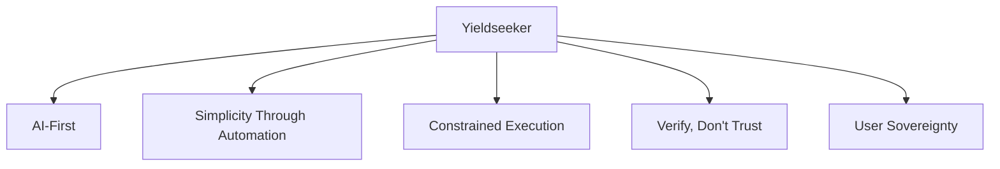
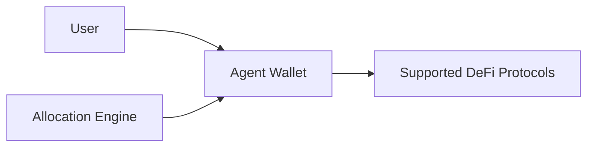

# Overview

Yieldseeker is an autonomous yield optimization protocol that uses AI agents to manage digital assets across decentralized finance (DeFi).

Each user deploys a dedicated agent that continuously evaluates supported opportunities, reallocates capital when appropriate, and compounds returns over time—all within a constrained execution framework designed to prioritise security, transparency, and user control.

Rather than requiring users to manually compare yields, monitor protocols, claim rewards, and rebalance positions, Yieldseeker automates portfolio management while keeping users in control of their assets. The result is an intelligent, continuously managed DeFi portfolio without the operational complexity traditionally associated with decentralized finance.

---

## Design Principles

Every aspect of Yieldseeker is guided by five core principles.

- **AI-First** — Autonomous AI agents continuously evaluate opportunities and manage portfolios on behalf of users.
- **Simplicity Through Automation** — Advanced DeFi strategies should be effortless to use without sacrificing transparency.
- **Constrained Execution** — Agents operate within strict protocol-defined execution rules rather than unrestricted authority.
- **Verify, Don't Trust** — Decisions are based on independently verifiable on-chain information wherever possible.
- **User Sovereignty** — Users retain ownership of their assets and remain in control at all times.

Learn more in **Design Principles**.

---

## High-Level Architecture

Each user owns an isolated Agent Wallet.

The allocation engine continuously evaluates supported opportunities and determines how capital should be allocated, while the protocol's execution framework ensures every action complies with predefined security constraints before interacting with supported DeFi protocols.

---

## Supported Assets

Yieldseeker currently supports **USDC** on the **Base** network.

Yieldseeker is designed to support multiple assets. Support for additional assets, including **cbBTC** and **wETH**, will be rolled out progressively as integrations complete testing and become available to users.

---

## Documentation Guide

This documentation is organised into four sections:

- **Introduction** explains the philosophy behind Yieldseeker and how the protocol works.
- **Protocol** covers the underlying architecture, execution model, and security framework.
- **Risk Management** explains how the allocation engine evaluates opportunities and manages portfolio risk.
- **Reference** contains supporting documentation, frequently asked questions, and protocol terminology.