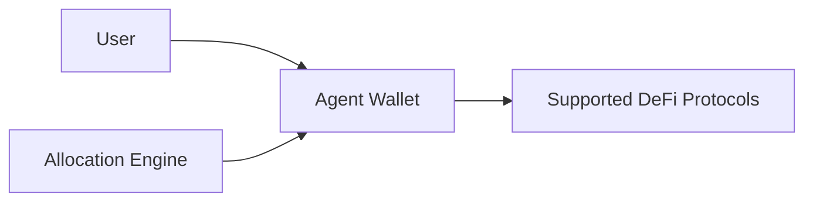

# Overview

Yieldseeker is an autonomous yield optimization protocol that uses AI agents to manage digital assets across decentralized finance (DeFi).

Each user deploys a dedicated agent that continuously evaluates supported opportunities, reallocates capital when appropriate, and compounds returns over time—all within a constrained execution framework designed to prioritise security, transparency, and user control.

Unlike traditional yield vaults that follow a single predefined strategy, Yieldseeker continuously evaluates multiple opportunities across supported protocols. Agents adapt as market conditions evolve, reallocating capital whenever expected long-term, risk-adjusted returns improve while accounting for liquidity, incentives, and transaction costs.

---

## Design Principles

Yieldseeker is built around three core principles.

### Constrained Execution

Agents are only permitted to perform explicitly authorised actions. Every transaction passes through protocol-specific validation before it can be executed, ensuring that agents cannot perform arbitrary blockchain operations.

Learn more in the **Execution Model** and **Adapter System** sections.

---

### Verify, Don't Trust

Wherever possible, Yieldseeker derives information directly from on-chain state instead of relying on third-party reported metrics. Portfolio decisions are based on protocol data, vault state, liquidity, and collateral information read directly from smart contracts.

Learn more in **Continuous Monitoring**.

---

### User Sovereignty

Users remain in control of their assets at all times. Funds are held inside isolated Agent Wallets, withdrawals are always initiated by the wallet owner, and administrative changes are protected by hardware-backed multisignature controls and a four-day timelock.

Learn more in **Security Model** and **Exit & Recovery**.

---

## High-Level Architecture

Each user owns an isolated Agent Wallet. The allocation engine manages this wallet within strict protocol-defined constraints, continuously interacting with supported DeFi protocols on behalf of the user.

---

## Supported Assets

Yieldseeker currently supports **USDC** on the **Base** network.

Yieldseeker is designed to support multiple assets. Support for additional assets, including **cbBTC** and **wETH**, will be rolled out progressively as integrations complete testing and become available to users.

---

## Documentation Guide

This documentation is organised into four sections:

- **Introduction** introduces Yieldseeker and explains the principles that guide its design.
- **Protocol** explains the underlying architecture, execution model, and security framework.
- **Risk Management** describes how the allocation engine evaluates opportunities and manages portfolio risk.
- **Reference** contains supporting documentation, frequently asked questions, and protocol terminology.