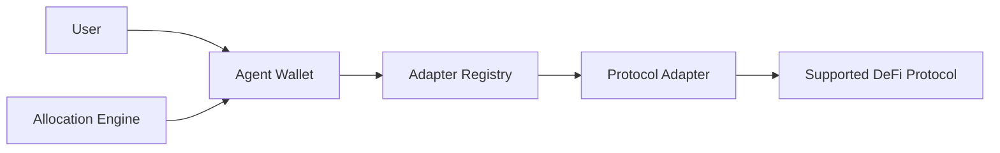
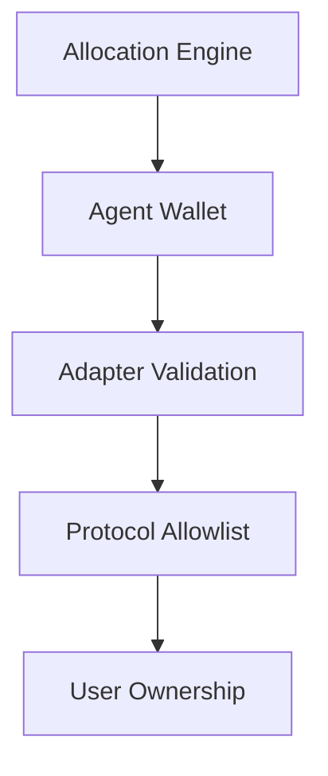

# Protocol Architecture

Yield Seeker is built around a modular execution framework that combines autonomous portfolio management with protocol-enforced security constraints.

Rather than relying on trust in a central operator, every component has a clearly defined responsibility. The allocation engine decides **what** should happen, while the smart contract infrastructure strictly controls **what is actually allowed** to happen.

The protocol is intentionally layered. Each component performs one specific role while limiting the responsibilities of every other component.

---

## User

Every user owns one or more Agent Wallets.

Users remain the ultimate owners of their assets throughout the lifetime of the wallet and retain the ability to withdraw funds or leave the protocol at any time.

Users can also customise how their agent behaves through natural-language rules, allowing each wallet to operate with different investment preferences.

---

## Agent Wallet

The Agent Wallet is the on-chain account that holds user assets.

Rather than interacting directly with DeFi protocols, the allocation engine operates through this wallet under strict permission controls.

Each wallet is completely isolated from every other wallet within the protocol.

The wallet is responsible for:

- holding assets
- executing validated transactions
- recording ownership
- enforcing withdrawal permissions
- maintaining user-level security controls

---

## Allocation Engine

The allocation engine continuously evaluates supported DeFi opportunities and determines how capital should be allocated.

Before execution, every candidate passes through a structured decision pipeline consisting of:

1. Candidate discovery
2. Eligibility filtering
3. Risk scoring
4. Allocation constraints
5. Execution

The engine determines **what should happen**, but it does not have unrestricted authority to execute arbitrary blockchain transactions.

---

## Adapter Registry

The Adapter Registry acts as the protocol's permission layer.

It maintains the list of:

- approved adapters
- approved protocol targets
- supported vaults
- supported integrations

If a protocol or contract has not been registered, it is unreachable by the execution framework.

This provides an on-chain allowlist that constrains every portfolio action.

---

## Protocol Adapters

Adapters translate generic portfolio actions into protocol-specific transactions.

Each adapter understands the protocol it integrates with and validates every transaction before execution.

Depending on the protocol, adapters may verify:

- recipient addresses
- supported assets
- vault registration
- collateral compatibility
- protocol-specific parameters

Only after validation succeeds is execution permitted.

---

## Supported Protocols

Yield Seeker currently supports a curated selection of established DeFi protocols on Base.

Examples include:

- Aave
- Morpho
- Compound
- Spark
- ERC-4626 vaults

Additional integrations may be introduced over time through the protocol's administrative extension process.

---

## Administrative Controls

Yield Seeker is designed to evolve without compromising security.

Supporting a new protocol or introducing new execution capabilities requires:

- smart contract extensions
- hardware-backed multisignature approval
- a four-day administrative timelock

This gives users advance notice before new functionality becomes available.

---

## Security Layers

No single component is responsible for protecting user assets.

Instead, security emerges from multiple independent layers working together.

Even if one layer were compromised, additional protections continue limiting what can occur.

---

## Design Principles

The protocol is built around three guiding principles.

### Constrained Execution

Agents can only perform explicitly authorised actions.

Execution is restricted by adapters, protocol allowlists, and parameter validation.

---

### Verify, Don't Trust

Portfolio decisions rely on direct on-chain observations wherever possible rather than third-party reported data.

---

### User Sovereignty

Users retain ownership of their assets throughout the lifetime of their Agent Wallet and always maintain a path to withdraw from the protocol.