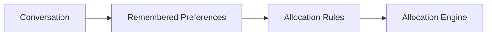

# Agent Intelligence

Agent Intelligence is the AI-powered layer that allows users to interact naturally with their Yieldseeker Agent.

Every Agent is capable of managing a portfolio autonomously from the moment it is created. Users who simply want automated portfolio management can choose an investment profile, deposit their assets, and allow the Agent to manage the portfolio independently.

For users who want greater control, Agent Intelligence enables natural-language interaction that allows portfolios to be personalised over time.

Agent Intelligence focuses on understanding user intent. It does not directly execute blockchain transactions or manage assets on-chain.

---

## Autonomous by Default

Yieldseeker is designed to reduce the amount of work required to manage a DeFi portfolio—not create more of it.

Every Agent begins with sensible default behaviour based on the selected investment profile:

- **Conservative**, which prioritises established protocols and lower-risk opportunities.
- **Explorative**, which considers a broader range of eligible opportunities while continuing to respect the protocol's risk constraints.

For many users, selecting an investment profile is all that's required. The Agent will continue managing the portfolio autonomously without any further interaction.

---

## Personalising Your Agent

Users who want more control can gradually personalise how their Agent behaves.

Through features such as **Discuss** and **Steer**, users can express preferences in natural language instead of configuring complex settings manually.

Examples include:

- "Only use Morpho vaults."
- "Prioritise stable yields."
- "Never allocate more than 20% to a single vault."
- "Avoid protocols with low liquidity."

Rather than exposing complex configuration options, Agent Intelligence interprets these requests and converts them into portfolio preferences that guide future allocation decisions.

---

## Remembered Preferences

Every Agent can behave differently.

As users continue interacting with their Agent, relevant preferences are remembered and incorporated into future portfolio decisions.

Examples include:

- preferred protocols
- preferred asset types
- risk tolerance
- diversification preferences
- liquidity requirements

These preferences can be updated, refined, or removed over time, allowing portfolio management to evolve alongside the user's objectives.

---

## Explaining Decisions

Agent Intelligence also helps users understand how their portfolio is being managed.

Users can ask questions such as:

- Why was capital reallocated?
- Why was this vault selected?
- Why wasn't another protocol chosen?
- Which preferences influenced this decision?

Providing transparent explanations helps users understand autonomous decisions without requiring them to inspect raw blockchain transactions or protocol-specific data.

---

## From Conversation to Portfolio Decisions

Agent Intelligence does not manage capital directly.

Instead, it converts conversations into structured preferences that are passed to the Allocation Engine.

The Allocation Engine then evaluates available opportunities while respecting those preferences alongside the Agent's selected investment profile.

---

## Separation of Responsibilities

Agent Intelligence is responsible for:

- understanding natural language
- remembering user preferences
- explaining portfolio decisions
- translating user intent into allocation rules

It is **not** responsible for:

- evaluating DeFi opportunities
- moving assets
- executing blockchain transactions

Those responsibilities belong to the Allocation Engine and Execution Framework.

Learn more in **Allocation Engine**.