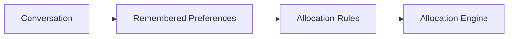

# Agent Intelligence

Agent Intelligence is the AI-powered layer that allows users to interact naturally with their Yieldseeker Agent.

Rather than configuring complex settings or writing rules manually, users simply describe their preferences through conversation. Agent Intelligence interprets those requests, remembers relevant information, and translates them into structured portfolio constraints that guide future allocation decisions.

Agent Intelligence focuses on understanding user intent. It does not directly execute blockchain transactions or manage assets on-chain.

---

## Natural-Language Interaction

Users communicate with their Agent through features such as **Discuss** and **Steer**.

Examples include:

- "Only use Morpho vaults."
- "Prioritise stable yields."
- "Never allocate more than 20% to a single vault."
- "Avoid protocols with low liquidity."

Rather than exposing complex configuration options, Agent Intelligence converts natural language into portfolio preferences.

---

## Personalised Behaviour

Every Agent can behave differently.

As users continue interacting with their Agent, relevant preferences are remembered and incorporated into future portfolio decisions.

Examples of personalised behaviour include:

- preferred protocols
- preferred asset types
- risk tolerance
- diversification preferences
- liquidity requirements

This allows portfolio management to become increasingly tailored over time while remaining easy to modify.

---

## Explaining Decisions

Agent Intelligence also helps users understand how their portfolio is managed.

Users can ask questions such as:

- Why was capital reallocated?
- Why was this vault selected?
- Why wasn't another protocol chosen?
- Which preferences influenced this decision?

Providing transparent explanations helps users understand how autonomous decisions are made without requiring them to inspect raw blockchain transactions.

---

## From Conversation to Portfolio Decisions

Agent Intelligence does not manage capital directly.

Instead, it converts conversations into structured preferences that are passed to the Allocation Engine.

The Allocation Engine then evaluates available opportunities while respecting those preferences.

---

## Separation of Responsibilities

Agent Intelligence is responsible for:

- understanding natural language
- remembering user preferences
- explaining portfolio decisions
- translating user intent into allocation rules

It is **not** responsible for:

- evaluating DeFi opportunities
- moving assets
- executing blockchain transactions

Those responsibilities belong to the Allocation Engine and Execution Framework.

Learn more in **Allocation Engine**.