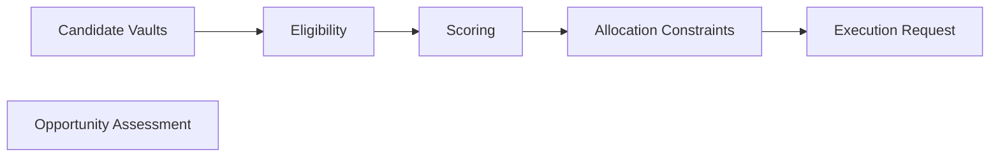

# Allocation Engine

The Allocation Engine, known as **Autoseek**, is responsible for managing each Agent's portfolio.

It continuously evaluates supported DeFi opportunities, determines how capital should be allocated, and requests portfolio changes when better opportunities become available.

Autoseek determines **what should happen**. It does not directly execute blockchain transactions.

---

## Continuous Evaluation

Rather than making one-time investment decisions, Autoseek continuously reassesses every portfolio.

It evaluates factors including:

- expected yield
- protocol risk
- liquidity
- diversification
- transaction costs
- user preferences
- current market conditions

This allows portfolios to adapt as opportunities evolve.

---

## Investment Profile

Every Agent operates using a selected investment profile.

### Conservative

Prioritises established protocols, deeper liquidity, and proven lending markets.

### Explorative

Expands the range of eligible opportunities while continuing to respect protocol-defined risk constraints.

Users can change their investment profile at any time.

---

## Portfolio Optimisation

Autoseek seeks to maximise long-term risk-adjusted returns rather than simply chasing the highest available yield.

Portfolio decisions balance multiple competing objectives, including:

- yield
- diversification
- liquidity
- protocol quality
- operational efficiency

This produces more stable portfolio behaviour over time.

---

## Continuous Rebalancing

As market conditions change, Autoseek may recommend reallocating capital.

Examples include:

- a higher-quality opportunity becoming available
- changing protocol conditions
- reduced liquidity
- deteriorating risk characteristics
- user preference updates

Rebalancing only occurs when it satisfies the protocol's decision criteria.

---

## Decision Pipeline

Every proposed allocation passes through a structured evaluation process before execution.

Each stage progressively filters and evaluates opportunities before a final allocation decision is produced.

Learn more in **Decision Pipeline**.

---

## Separation of Responsibilities

The Allocation Engine is responsible for:

- evaluating opportunities
- selecting allocations
- portfolio optimisation
- rebalancing decisions

It is **not** responsible for:

- interpreting user conversations
- executing blockchain transactions
- validating protocol interactions

Those responsibilities belong to Agent Intelligence and the Execution Framework.

Learn more in **Execution Framework**.