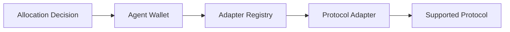

# Execution Framework

The Execution Framework is responsible for safely executing the decisions produced by the Allocation Engine.

Rather than allowing unrestricted blockchain interactions, every transaction must pass through a series of protocol-enforced validation steps before execution.

This constrained execution model is a core part of Yieldseeker's security architecture.

---

## Agent Wallets

Each Agent is assigned its own dedicated Agent Wallet.

Agent Wallets:

- securely hold user assets
- isolate each portfolio from every other Agent
- execute validated transactions
- enforce user ownership

Assets are never pooled across users.

Each Agent operates independently.

---

## Execution Flow

Portfolio decisions are converted into blockchain transactions through a controlled execution pipeline.

Every layer performs validation before allowing execution to continue.

---

## Protocol Adapters

Each supported protocol has a dedicated adapter.

Adapters understand the protocol they integrate with and translate generic allocation requests into protocol-specific transactions.

Before execution, adapters verify information such as:

- supported assets
- protocol addresses
- compatible vaults
- protocol-specific parameters

Only validated transactions may proceed.

---

## Adapter Registry

The Adapter Registry maintains the protocol's allowlist.

It defines which:

- adapters
- protocols
- integrations

may be accessed by the Execution Framework.

If an integration is not registered, it cannot be used by an Agent.

---

## Execution Guarantees

The Execution Framework ensures that:

- transactions only reach approved protocols
- unsupported interactions are rejected
- user assets remain isolated
- ownership is preserved
- execution remains constrained by protocol rules

This separation allows portfolio management to remain autonomous without granting unrestricted transaction authority.

---

## Separation of Responsibilities

The Execution Framework is responsible for:

- transaction validation
- blockchain execution
- asset custody
- protocol integrations

It is **not** responsible for:

- understanding user intent
- selecting portfolio allocations

Those responsibilities belong to Agent Intelligence and the Allocation Engine.

Learn more in **Security Model**.