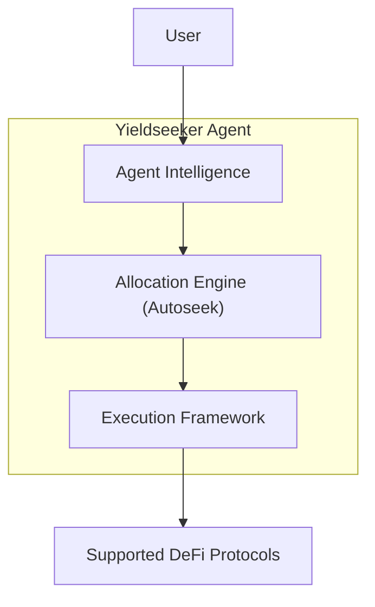

# Protocol Architecture

Yieldseeker is built around autonomous **Agents** that manage individual user portfolios.

Each Agent combines AI-powered intelligence with an autonomous allocation engine and a constrained on-chain execution framework, allowing portfolios to be managed automatically while preserving user ownership and protocol-enforced security.

Rather than relying on trust in a central operator, responsibility is divided across several independent components. This separation allows the protocol to evolve over time while reducing overall system risk.

Every Agent operates independently. It understands user preferences, manages portfolio allocations, and safely executes transactions through the protocol's execution framework.

---

## User

Every user creates one or more Yieldseeker Agents.

Although portfolio management is autonomous, users always retain ownership of their assets. They can fund their Agent Wallet, customise behaviour, update their investment profile, or withdraw at any time.

---

## Yieldseeker Agent

A Yieldseeker Agent is an autonomous portfolio manager created specifically for an individual user.

Rather than being a single component, an Agent combines three specialised systems that work together:

- **Agent Intelligence**, which understands user intent and enables natural interaction.
- **Allocation Engine (Autoseek)**, which continuously evaluates opportunities and determines how capital should be allocated.
- **Execution Framework**, which validates and executes approved on-chain transactions.

Separating these responsibilities allows each subsystem to evolve independently while maintaining strong security guarantees.

---

## Agent Intelligence

Agent Intelligence is how users interact with their Agent.

Powered by AI, it enables natural-language conversations through features such as **Discuss** and **Steer**, allowing users to:

- ask questions about portfolio decisions
- personalise portfolio behaviour
- express investment preferences
- understand how their Agent is operating

It remembers relevant preferences over time and translates them into structured rules that influence future allocation decisions.

Agent Intelligence focuses on understanding user intent—it never executes blockchain transactions directly.

---

## Allocation Engine (Autoseek)

Autoseek is the Agent's autonomous portfolio management engine.

It continuously evaluates supported opportunities and determines how capital should be allocated based on:

- expected risk-adjusted returns
- the selected investment profile
- personalised user preferences
- current market conditions
- protocol-defined risk constraints

The Allocation Engine determines **what should happen**.

Every proposed action must still be validated by the Execution Framework before it can occur on-chain.

Learn more in **Decision Pipeline**.

---

## Execution Framework

The Execution Framework safely converts portfolio decisions into blockchain transactions.

It consists of several protocol components working together, including:

- **Agent Wallets**, which securely hold user assets
- the **Adapter Registry**, which defines approved integrations
- **Protocol Adapters**, which validate protocol-specific transactions before execution

Together these components ensure that every transaction is validated and constrained by protocol-defined security rules.

Learn more in **Execution Framework**.

---

## Supported DeFi Protocols

Yieldseeker currently integrates with a curated selection of established DeFi protocols on Base.

These include:

- Morpho
- Aave
- Spark
- Compound
- ERC-4626 vaults

Additional integrations may be introduced over time through the protocol's administrative extension process.

---

## Administrative Controls

Yieldseeker is designed to evolve without compromising security.

Supporting new protocols or introducing additional execution capabilities requires:

- smart contract extensions
- hardware-backed multisignature approval
- a four-day administrative timelock

This provides users with advance notice before new functionality becomes available.

---

## Security Through Separation

Each major subsystem within an Agent has a deliberately limited responsibility.

**Agent Intelligence** understands user intent.

The **Allocation Engine** determines how capital should be managed.

The **Execution Framework** validates and executes permitted transactions.

Users retain ownership of their assets throughout the entire process.

This separation of responsibilities reduces system complexity, limits trust assumptions, and allows each subsystem to evolve independently without compromising the overall security model.