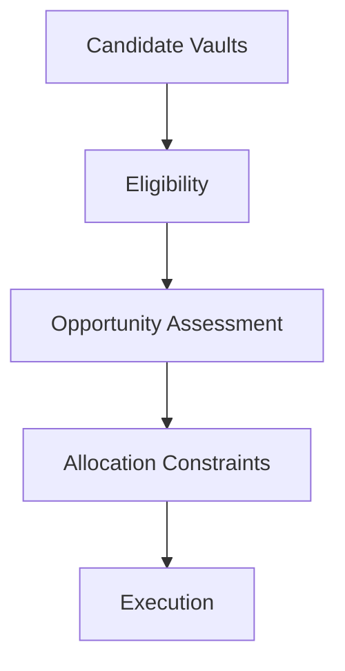

# Decision Pipeline

Every time a Yieldseeker Agent evaluates whether to rebalance a portfolio, it follows the same structured decision process.

Rather than simply selecting the highest advertised APY, every candidate opportunity passes through multiple stages of evaluation before execution is considered.

Each stage progressively narrows the candidate set until only suitable allocations remain.

---

## Stage 1 — Candidate Discovery

The Allocation Engine begins by identifying candidate vaults across the supported protocol ecosystem.

Only protocols that have been explicitly integrated into the Execution Framework through dedicated protocol adapters are considered. Protocols outside the Adapter Registry are excluded from consideration entirely.

This ensures that every candidate opportunity originates from a protocol that has been reviewed, integrated, and approved by the protocol.

---

## Stage 2 — Eligibility

Each candidate vault is evaluated against a set of objective eligibility parameters.

These parameters determine whether a vault is fundamentally compatible with the protocol before further assessment takes place.

Examples include:

- supported protocol
- supported vault type
- supported assets
- operational availability

Candidate vaults that fail any mandatory eligibility requirement are excluded before further assessment begins.

---

## Stage 3 — Opportunity Assessment

Eligible vaults are then assessed across multiple parameters.

Rather than optimising purely for APY, the Allocation Engine considers multiple dimensions simultaneously, including expected yield, liquidity, collateral quality, market conditions, and other protocol-defined parameters.

This enables Autoseek to identify opportunities that balance yield, liquidity, and portfolio quality rather than reacting to short-term yield fluctuations.

For more information about the parameters used during this stage, see **Vault Selection**.

---

## Stage 4 — Allocation Constraints

Before execution, additional portfolio-level constraints are applied.

These include:

- diversification requirements
- concentration limits
- protocol exposure
- user preferences and constraints
- investment profile

Even the highest-ranked opportunity may receive only part of a portfolio if broader allocation constraints require a more balanced distribution of capital.

---

## Stage 5 — Execution

Only after every previous stage has completed successfully does the Execution Framework begin interacting with supported protocols.

Every transaction is validated through the protocol's constrained execution architecture before being submitted on-chain, ensuring that all execution remains restricted to approved protocol adapters and protocol-defined security rules.

---

## Explainable Decisions

Every allocation follows the same deterministic decision pipeline.

Users can ask their Agent why a portfolio change occurred or why a particular vault was selected.

This makes portfolio management transparent rather than opaque.