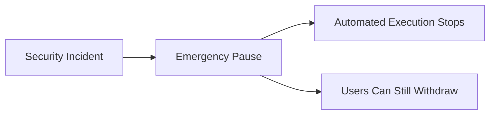

# Exit & Recovery

One of Yieldseeker's core design principles is **User Sovereignty**.

Users should never depend entirely on the continued operation of the Yieldseeker application to retain access to their assets.

Recovery is not a single emergency procedure. It is the collection of mechanisms that allow users to retain or regain control of their assets under a range of operational conditions.

---

## Standard Withdrawals

Users may withdraw their assets at any time through the Yieldseeker interface.

Only the owner of an Agent Wallet can initiate withdrawals.

Neither the Yieldseeker backend nor protocol administrators can withdraw assets from a user's wallet.

---

## Frontend or Backend Unavailability

If the Yieldseeker application is temporarily unavailable, users do not lose ownership of their Agent Wallet.

Users can interact directly with the underlying smart contracts to recover their assets. Where appropriate, the Yieldseeker team can provide guidance during that process.

The application provides convenience—not custody.

---

## Protocol Incidents

If a supported protocol experiences elevated risk, unexpected behaviour, or a publicly disclosed exploit, Yieldseeker may respond by marking that protocol or vault as ineligible for future allocations through its protocol safety parameters.

Where appropriate, Agents may also be instructed to withdraw from affected positions as part of a coordinated safety response before reallocating capital to other supported opportunities.

Because DeFi protocols remain permissionless systems, no protocol can guarantee that withdrawals will always succeed under extreme market conditions.

For example, a sudden liquidity run or protocol-wide failure may temporarily limit the ability to exit a position immediately.

Yieldseeker is designed to respond as quickly as possible while remaining transparent about these inherent limitations.

---

## Emergency Pause

Yieldseeker includes an emergency pause mechanism that immediately suspends automated execution across the protocol.

This control is intended for situations such as:

- suspected infrastructure compromise
- operational incidents
- unexpected protocol behaviour
- security investigations

An emergency pause suspends automated execution while preserving user ownership and withdrawal rights.

---

## Administrative Changes

Yieldseeker continues to evolve by supporting additional assets, protocols, and autonomous capabilities.

To protect users, administrative extensions cannot become active immediately.

Every protocol extension is protected by:

- hardware-backed multisignature approval
- a four-day administrative timelock

This provides users with advance notice of upcoming protocol changes and an opportunity to withdraw their assets before new functionality becomes available if they choose.

---

## User Sovereignty

Regardless of future protocol upgrades or operational changes, users remain in control of their participation.

Users may:

- withdraw their assets at any time
- stop using the protocol
- configure how their Agent allocates capital
- block access to underlying protocol targets

Yieldseeker provides autonomous portfolio management, but participation always remains voluntary. Ownership and control remain with the user throughout the lifetime of every Agent.