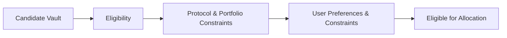

# Vault Selection

Vault selection is a progressive process rather than a single scoring event.

Before capital can be allocated, every candidate vault passes through multiple stages of evaluation. Rather than relying on a single risk score, Autoseek progressively filters, evaluates, and ranks opportunities using a broad set of protocol-defined parameters together with user-defined preferences and constraints.

These parameters assess different aspects of a vault's suitability, helping ensure that every allocation reflects both protocol safeguards and the user's investment objectives.

---

## Eligibility

Every candidate vault must first satisfy a set of objective eligibility parameters before it can be considered for allocation.

These parameters determine whether a vault is fundamentally compatible with the protocol and include factors such as:

- integration through the Execution Framework
- supported protocol
- supported vault type
- supported assets
- operational availability

Only protocols that have been explicitly integrated through dedicated protocol adapters are eligible for consideration. Candidate vaults that fail any mandatory eligibility requirement are excluded before further evaluation begins.

---

## Protocol Constraints

Eligible vaults are then evaluated using protocol-specific parameters that assess the characteristics of the underlying strategy.

Examples include:

- collateral quality
- supported strategy type
- protocol-specific risk considerations
- restricted or unsupported assets

These parameters help ensure that allocations remain consistent with the protocol's supported investment universe.

---

## Liquidity Constraints

Yield generation is only valuable if positions can be entered and exited efficiently.

Liquidity parameters evaluate factors such as:

- total value locked (TVL)
- withdrawable liquidity
- market depth
- concentration relative to vault size

Rather than rejecting otherwise suitable opportunities, allocation sizes may be adjusted to remain proportionate to available liquidity.

---

## Portfolio Constraints

Vaults are evaluated not only individually, but also in the context of the overall portfolio.

Portfolio parameters help maintain balanced exposure by considering factors such as:

- diversification across protocols
- concentration within individual vaults
- overall portfolio composition
- exposure to similar strategies

These constraints help reduce unnecessary concentration risk while maintaining efficient capital allocation.

---

## User Preferences & Constraints

Users can personalise how their Agent allocates capital by defining persistent preferences and allocation rules.

Examples include:

- never use a particular vault
- only allocate to specific protocols
- maintain a minimum allocation to one protocol
- limit maximum exposure to an individual vault
- prefer stable returns over short-term APY increases

These preferences and constraints become persistent rules for that individual Agent and are automatically incorporated into future allocation decisions.

---

## Investment Profile

Every Agent operates using a configurable investment profile.

The default **Conservative** profile prioritises larger, more established opportunities with stricter selection parameters and allocation constraints.

The **Explorative** profile broadens the range of eligible opportunities while maintaining the same execution safeguards.

The selected investment profile establishes the default selection behaviour before any user-defined preferences or constraints are applied.

---

## Continuous Evolution

The vault selection framework is designed to evolve over time.

As new protocols, strategies, and market conditions emerge, Yieldseeker continuously refines the parameters used to evaluate opportunities while preserving the overall decision pipeline.

New protocol integrations undergo technical review before dedicated protocol adapters are developed and registered within the Adapter Registry. They only become eligible for allocation after completing the administrative approval process and four-day timelock.

This approach allows the allocation framework to improve over time while ensuring that execution remains restricted to explicitly reviewed and approved protocol integrations.